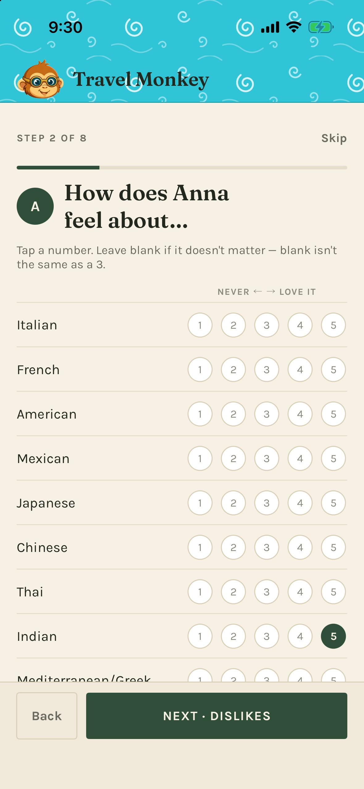
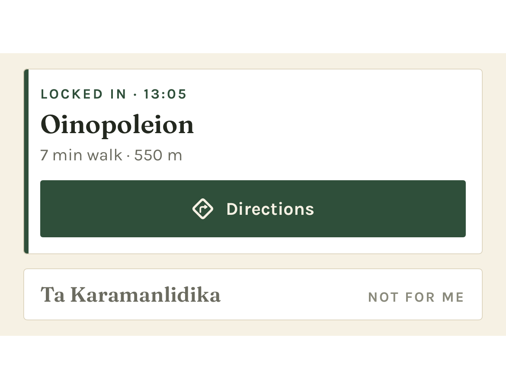

# Travel Monkey quick start

[Support](README.md) · [Full user guide](user-guide.md) · [Privacy Policy](privacy.md)

Last updated: October 2, 2026

Set up your preferences, try a sample trip, and get your first recommendation.
You need Travel Monkey installed on an iPhone running iOS 17 or later, a connection,
and your own Anthropic API key for concierge questions. The current app is installed
with the developer's help.

## 1. Tell it who is traveling

On first launch, add your household travelers. Rate a few favorite cuisines and
activities, and enter dislikes and allergies separately. Leave ratings blank when you
have nothing to record; blank does not mean 3.

*Screenshots use demonstration data. Your travelers and suggestions will differ.*

Enter shared logistics such as transport preference, budget, and comfortable walking
time. You can skip optional details and edit them later in **Profile**.

## 2. Enable the concierge and reminders

During setup:

- Allow location **While Using the App** for nearby recommendations and travel times.
- Allow notifications if you want leave-by and meal-log reminders.
- Paste your Anthropic API key, then finish with **Ask me where to eat**.

Get a key through the [Claude Console](https://console.anthropic.com), following
[Anthropic's key instructions](https://platform.claude.com/docs/en/manage-claude/authentication).
API usage is [billed separately from a Claude chat subscription](https://support.claude.com/en/articles/9876003-i-have-a-paid-claude-subscription-pro-max-team-or-enterprise-plans-why-do-i-have-to-pay-separately-to-use-the-claude-api-and-console).

Skipped the key or a permission? Open **Profile → Settings** to add the key or use
**Change in iOS Settings**. The key is stored in the iOS Keychain.

## 3. Try the sample trip

Open **Profile → Settings → Load sample data**. It loads a trip with dates near today
and makes it active.

- Open **Daily** to see the day's plan; use the arrows to browse.
- Open **Trip** for all days and **Reservations** for booking details.
- Return to **Concierge** to see the next hard deadline and weather when available.

The sample does not move your phone's location. To ask about its destination, say
“Suggest lunch near the hotel in the sample trip.” Sample deadlines can produce real
local reminders. If the sample file is missing, ask the developer for a build that
includes it; you can still try the concierge without a trip.

**Your own trip:** the current app requires the developer's help for the initial
import. Once the trip exists, **Trip → Add from text** lets you paste more bookings,
review the proposed details, and tap **Confirm**. It does not create your first trip.

## 4. Ask, refine, and choose

Open **Concierge** and ask “Where should we eat?” or tap a suggestion chip.
Wait for the reply to finish, then use the card controls:

- **ⓘ** expands extra reasoning when available.
- **Not for me** lets you explain why the option misses.
- **Lock it in** records your choice and adds it to today's active trip.
- **Directions** appears on the locked card and opens Apple Maps. Long-press it for
  Google Maps if installed.

*Locking in records a plan; it does not make a booking.*

For something easier, tap the **Normal** pill above the conversation and choose
**Low-key today**. In that same sheet, **Who's out right now** selects the people
joining this outing. The whole-trip roster lives under **Trip → Who's coming**.

## 5. Leave on time and remember what worked

Check the deadline strip's **Leave by** time. With notifications allowed, the app
normally reminds you an hour before leave-by and again when it is time to go.
These are scheduled phone reminders; the concierge does not monitor travel changes
or follow up later on its own.

After a locked-in meal, use **Log it** when it appears, or the meal reminder.
Choose **Loved it**, **Fine**, or **Not again**, add a useful short note, and tap
**Save to log**. Find your entries in **Profile → Meal & activity log**.

When you finish trying the sample, use **Profile → Settings → Remove sample data**.
This deletes the sample and anything asked or logged on it; your own trips remain.

For the remaining features, see the [full user guide](user-guide.md). For help, see
[Support](README.md). If something looks wrong, check the key, connection, permissions,
and active trip first.
