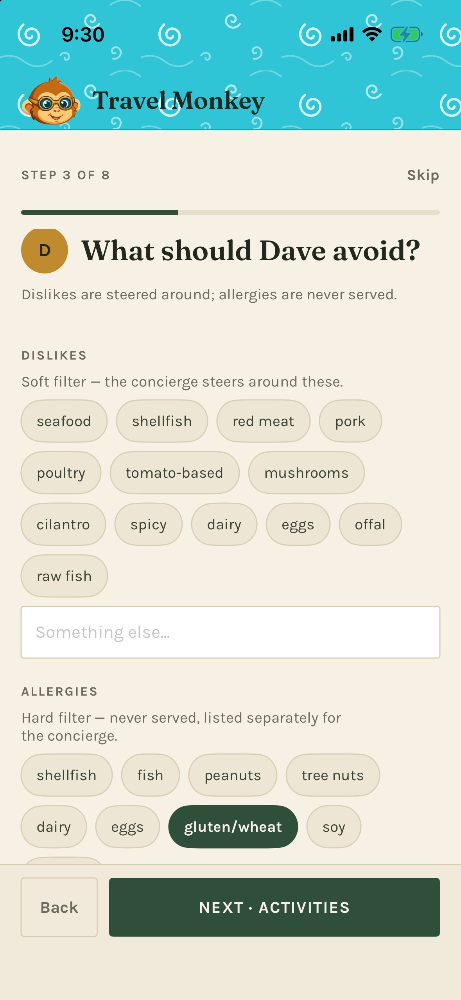
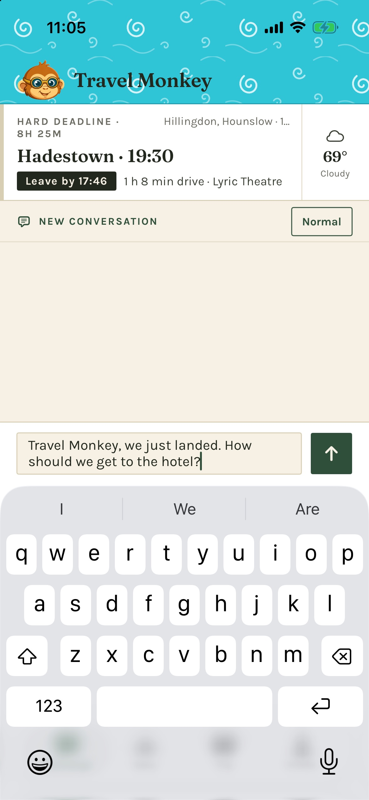
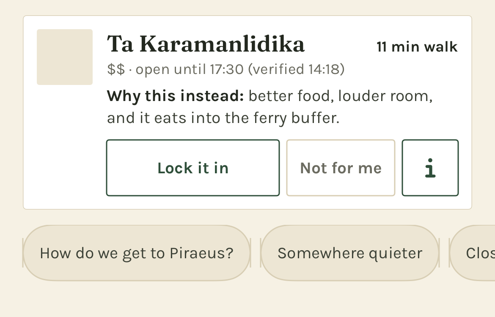
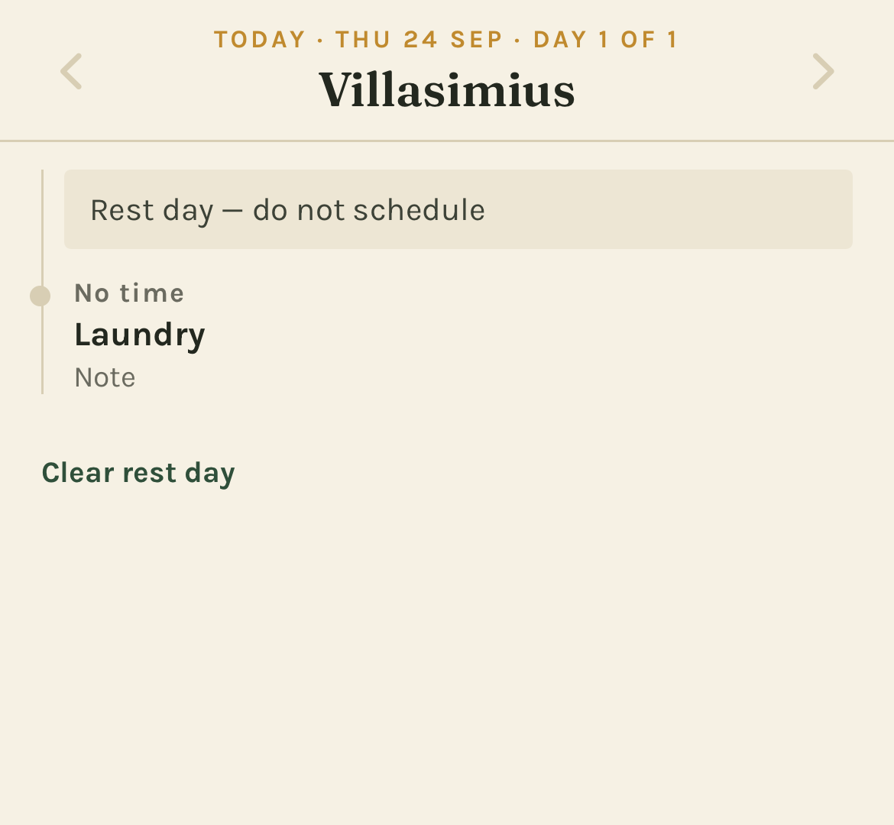
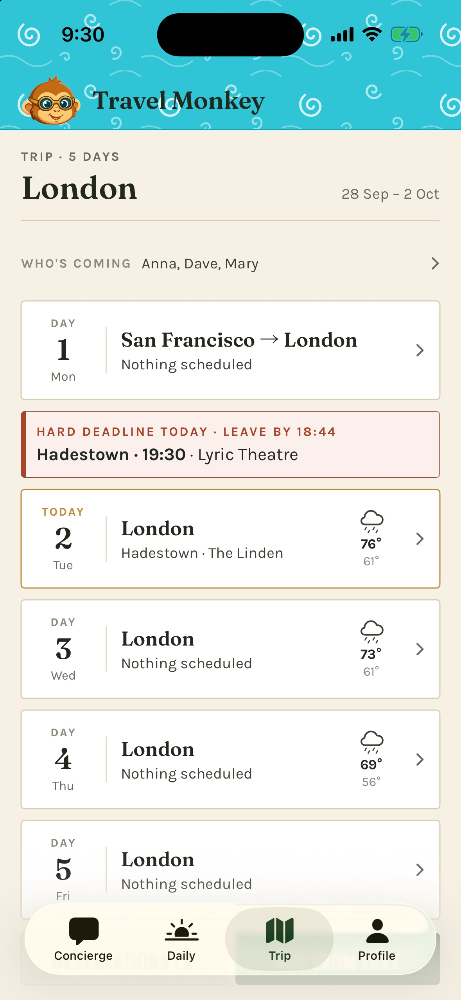
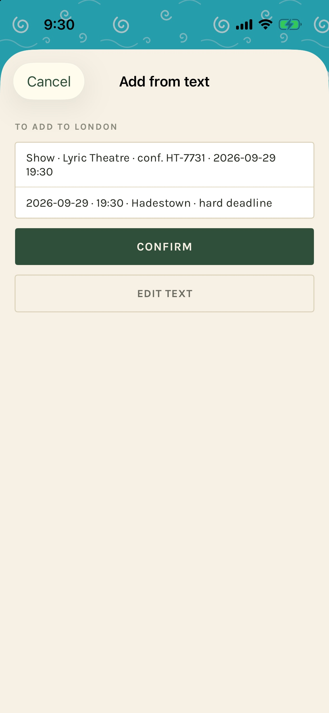
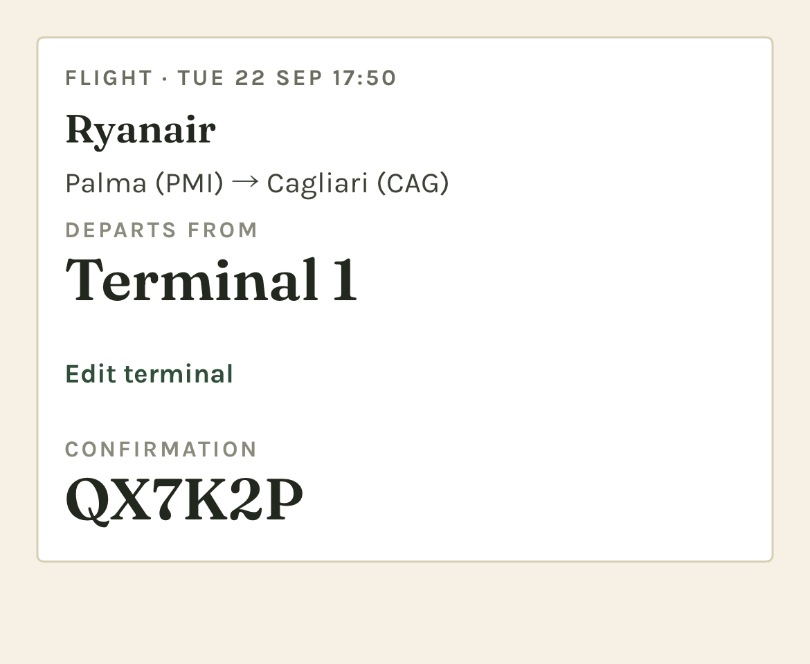
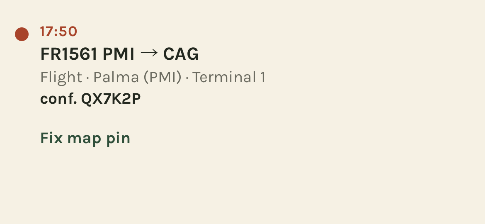
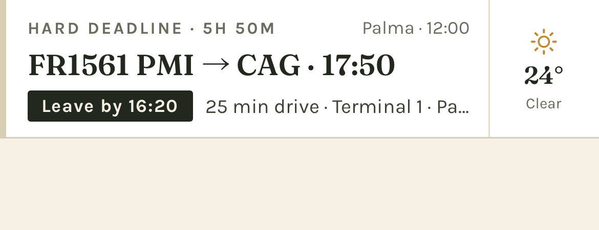

# Travel Monkey user guide

[Support](README.md) · [Quick start](quick-start.md) · [Privacy Policy](privacy.md)

Last updated: October 2, 2026

Travel Monkey is an iPhone travel concierge. It combines your travelers' preferences,
your itinerary and reservations, your meal and activity log, and the phone's location
and clock to help you decide where to eat, what to do, and when to leave.

This guide describes the current app. Screenshots use demonstration or test data,
including fictional travelers and booking codes. Some show an individual part of a
screen. Dates, weather, travel times, and places in the pictures are examples, not
current travel advice.

## Contents

- [Before you begin](#before-you-begin)
- [Set up your household](#set-up-your-household)
- [Find your way around](#find-your-way-around)
- [Ask the concierge](#ask-the-concierge)
- [Choose a recommendation](#choose-a-recommendation)
- [Set your energy and who is out](#set-your-energy-and-who-is-out)
- [Read your daily plan](#read-your-daily-plan)
- [Manage your trip and reservations](#manage-your-trip-and-reservations)
- [Use maps and directions](#use-maps-and-directions)
- [Check the weather](#check-the-weather)
- [Understand leave-by reminders](#understand-leave-by-reminders)
- [Log meals and activities](#log-meals-and-activities)
- [Teach the concierge](#teach-the-concierge)
- [Edit profiles and settings](#edit-profiles-and-settings)
- [Data, iCloud, and offline use](#data-icloud-and-offline-use)
- [Troubleshooting](#troubleshooting)

## Before you begin

You need an iPhone running iOS 17 or later and an installed copy of Travel Monkey.
The current version is installed by the developer from Xcode. It has no Travel Monkey
account or sign-in screen.

To use the concierge, you also need:

- A network connection.
- Your own Anthropic API key, with API usage enabled on its account.
- Location permission for recommendations and travel estimates from where you are.
- Notification permission if you want reminders.

Create a key through the [Claude Console](https://console.anthropic.com). Anthropic's
[API key instructions](https://platform.claude.com/docs/en/manage-claude/authentication)
explain the current steps. API usage is billed separately from a Claude chat
subscription; see [Anthropic's explanation](https://support.claude.com/en/articles/9876003-i-have-a-paid-claude-subscription-pro-max-team-or-enterprise-plans-why-do-i-have-to-pay-separately-to-use-the-claude-api-and-console).

**A current limitation:** your own initial trip must be prepared and imported with the
developer's help in a developer-installed build. **Add from text** adds bookings to a
trip that already exists; it does not create your first trip. You can still ask the
concierge questions without a trip, or try [sample data](#try-a-sample-trip).

## Set up your household

First launch walks you through eight steps. You can skip optional details and return
to them in **Profile**.

1. **Who's traveling?** Add the household's travelers and optional age bands.
2. **Cuisines.** Rate each traveler's preferences from 1 to 5. Leave a rating blank if
   you have no preference to record: blank is different from a neutral 3.
3. **Dislikes and allergies.** Enter them separately for each traveler. Dislikes are
   preferences to steer around; allergies are treated as hard exclusions. Use
   **Something else** for an allergy that has no chip.
4. **Activities.** Rate interests such as architecture, hiking, museums, food tours,
   and live music. Set the household's maximum museums per day.
5. **Travel logistics.** Enter home airports, loyalty programs, card perks, preferred
   transport, budget posture, lodging style, and maximum continuous walking time.
6. **Permissions.** Allow location while using the app and notifications if you want
   nearby suggestions and reminders. You can change either later.
7. **API key.** Paste your Anthropic API key. The app checks it before saving it to
   the iOS Keychain. You can skip this step and add it in **Profile → Settings**.
8. **Done.** Tap **Ask me where to eat** to open the Concierge tab.

*Tap only the ratings you want to record; scroll for the remaining cuisines.*

*An allergy belongs in the Allergies section, including when you enter it as free text.*

You can revisit the whole flow with **Profile → Re-run onboarding**, which starts with
your existing household details. Guests have their own separate setup under
[Travel companions](#travelers-and-guests).

## Find your way around

The bottom bar has four tabs:

| Tab | Use it for |
|---|---|
| **Concierge** | Questions, recommendations, the next deadline, current weather, energy, and conversations |
| **Daily** | Today's map, timeline, lodging, and weather; arrows let you browse other days |
| **Trip** | The complete day list, who's coming, reservations, and adding bookings |
| **Profile** | Travelers, guests, household logistics, meal and activity log, rules, and settings |

**Settings** and the **Meal & activity log** are inside Profile.

## Ask the concierge

Open **Concierge**, type in **Ask anything…**, and tap the upward arrow to send.
You do not normally need to retype your preferences, location, or today's itinerary.
The app supplies the context it has with each request.

Try questions such as:

- “Where should we eat near the hotel?”
- “What can we do before tonight's show?”
- “Plan tomorrow around our train.”
- “We're tired. Give us something close and easy.”
- “What is still unverified for our departure?”

*The deadline stays above the conversation. Type your question below; the arrow sends it.*

The suggestion chips above the composer are shortcuts. Swipe sideways to see more.
After some recommendations, they change to refinements such as **Somewhere quieter**.
Tapping a question or refinement sends it immediately. The chips hide while the keyboard
is open.

Replies arrive progressively. The turning monkey mark and messages such as
**Finding places nearby…** or **Checking travel times…** indicate work in progress.
Lookups can take longer than a simple answer. Wait until the reply finishes to use its
recommendation controls.

### Conversations

Tap the conversation label above the transcript to open its menu. Choose **New
conversation** to start fresh, or select an earlier conversation to read it and
continue. Conversations belong to the trip and are labeled with the opening question.
Starting a new one keeps the old one.

### What to expect

The concierge explains why a suggestion fits and what its tradeoffs are. It may say
that a fact is unverified or ask for missing information. Tell it when something is
wrong, and ask it to check current details when needed.

It responds when you ask; it does not watch flights, opening hours, or weather and come
back later on its own. A promised or suggested check is not a scheduled reminder.
For a reminder, ask for an alarm and check that the reply confirms it was set.
Travel Monkey does not make bookings or purchases.

## Choose a recommendation

A place recommendation appears as a card. The lead option is larger; alternatives may
be compact. Cards can include a map, a street-level photo where available, estimated
travel times, a price band, an opening-hours note, a reason, and a tradeoff.

*A compact card has the same choice controls as the lead card. This example shows the
image placeholder rather than loaded map imagery.*

| Control | What it does |
|---|---|
| **Lock it in** | Records your choice in the conversation and, with an active trip, adds it to today's itinerary |
| **Not for me** | Declines the option and lets you give an optional reason |
| **ⓘ** | Expands more reasoning in place, when the recommendation has extra detail |
| **Directions** | Appears after locking in; opens the chosen destination in Maps |
| **Log it** | Appears on an unlogged locked plan once its recorded time has passed |

With an active trip, locking in records an estimated arrival time based on the current
time and travel estimate, rounded up to the next five minutes. It is a choice for now,
not a restaurant reservation. For a future booking, use **Trip → Add from text**.
Without an active trip, lock-in records the decision in chat but creates no trip item
or meal reminder.

*Once chosen, the card collapses to your plan and its Directions control.*

Check any verification time shown beside opening hours. It describes the information
used for that answer; it is not a live status feed. **Also considered**, when shown,
explains an alternative the concierge weighed and did not choose.

## Set your energy and who is out

Tap the energy pill on the right of the conversation bar. It initially says **Normal**.
The sheet offers:

| State | What to ask for |
|---|---|
| **Normal** | Full days and the usual range of activities |
| **Low-key today** | Shorter walks, sitting down, and lower-effort options |
| **Rest day** | Food and hard deadlines, with no additional activity planning |

Under **Who's out right now**, tap travelers to include or exclude them from this
outing. Someone excluded is shown as resting. At least one traveler stays selected.
The next request uses this selection for group recommendations.

This is different from **Trip → Who's coming**, which records the whole trip's roster.
Today's energy and outing selection reset at the start of a new trip day. A saved rest
day is read when the Concierge next checks that day.

After repeated declines of higher-effort suggestions, the app may offer **Switch to
Low-key today?** Choose **Yes** or **Not now**. It does not change the setting without
your tap.

## Read your daily plan

Open **Daily** for today. Before the trip it opens on the first day; after the trip,
on the last. Use the left and right arrows to move between days.

A day can show its map, hourly forecast, hard-deadline callouts, timed items, work hours,
untimed notes, and tonight's lodging. Hard deadlines sit above the timeline. Untimed
items appear after timed ones. Times are shown in the zone where the event happens;
a city is named when needed to distinguish zones.

At the bottom, tap **Mark rest day** to record a lighter day, or **Clear rest day** to
remove that mark. Marking a rest day does not delete bookings or move deadlines.
If you clear the mark after Concierge has switched to Rest day, change the energy pill
back yourself.

*A rest day still shows your recorded plans and notes.*

## Manage your trip and reservations

### Browse the trip

Open **Trip** for the complete day list. Today is highlighted. Tap a day to open its
map and timeline. A hard deadline appears in a separate callout above that day's row,
with a leave-by time when one can be calculated.

*The trip's roster is at the top; a deadline gets its own callout above the day.*

### Try a sample trip

Open **Profile → Settings → Load sample data**. The bundled sample is shifted to dates
near today and becomes the active trip. You can explore Trip and Daily and ask the
concierge about it.

The sample does not move your phone's location. At home, ask explicitly about the
sample city or hotel. Nearby suggestions otherwise use your actual location. Sample
plans can schedule real local reminders on your phone.

**Reload sample data** moves its dates near today again and keeps its conversations
and logs. **Remove sample data** asks for confirmation, then deletes the sample trip
and its conversations and logs. Your own trips remain; the app selects the appropriate
current or upcoming trip again.

If loading reports missing seed data, ask the developer for a build that includes the
sample. Do not treat the sample's reservations as your own bookings.

### Get your own initial trip into the app

The current developer-installed build imports prepared trip documents. Arrange this
with the developer first. When the files are included, use **Import trip data** from
the no-trip screen, or **Profile → Settings → Developer → Import from markdown**.
Review the preview before confirming, especially dates, travelers, allergies, and
hard deadlines. Cancel leaves the existing records untouched.

This import control is available only in developer builds. A regular release build
currently has no self-service way to create your own initial trip. Pasting a booking
into **Add from text** requires an existing trip.

### Add a booking or note to an existing trip

1. Open **Trip → Add from text**.
2. Paste the confirmation email, booking details, or notes.
3. Tap **Read it**. This sends the text to the concierge and requires a network and
   a working API key.
4. Review everything it proposes: day, time, place, confirmation code, and whether
   the item is a hard deadline.
5. Tap **Confirm** to save, **Edit text** to revise the input, or **Cancel** to leave.

*Reading the text produces a proposal. It is saved only after Confirm.*

Use **Add manually** if you want to enter an item yourself, if parsing fails, or if you
are offline. Choose a title, kind, day, optional time, and place. Mark **Hard deadline —
can't be missed** when appropriate. The form also has an optional confirmation code,
an **International flight** switch for flights, and **Border check before boarding,
like the Eurostar** for trains. Those distinctions affect arrival buffers.

A lodging booking can fill tonight's lodging across its stay. Pasted items on new dates
can add days to an existing trip. Check Daily after saving to make sure the plan reads
as intended. The current app has no general editor for every stored booking field;
check parsed details before Confirm.

### Read reservations and store a departure terminal

From **Trip**, open **Reservations**. Use the kind filters to narrow the list.
Cards show dates, routes, large confirmation codes, and seats where recorded.
Expand **Original text** when present to reread the source. Codes can be selected and
copied.

*The departure terminal and confirmation code are easy to read at the airport.*

On a flight, tap **Add departure terminal** or **Edit terminal**, enter the value, and
save. Saving an empty value clears it. A stored terminal also appears with the flight
in Daily, deadline callouts, and reminders.

You can also ask the concierge to look up a missing terminal. If it offers to save one,
review the source and tap **Save** or **Not now**. It needs your tap to store the change.
Terminals are stored information; gates and travel status are not monitored live.

## Use maps and directions

Day maps show located items and lodging, with legs between consecutive timed places.
Long intercity legs may be dashed straight lines. The map is an overview; navigation
opens in a separate Maps app.

On a locked recommendation, tap **Directions** for Apple Maps. Long-press it to choose
Google Maps if installed. The destination and travel mode are passed to that app.

On recommendation maps, green marks the destination and brass marks the location used
for the estimate. When the estimate is from lodging, the origin is shown as a house.
Without a usable location, distances may be from lodging; check the label.

A **no map** badge means the item saved but its place could not be located. It does not
mean the booking is missing. For an itinerary item, use **Find map pin** if it has no
pin, or **Fix map pin** if the saved pin is wrong, and review the confirmation before
retrying the lookup.

*Repair the selected place from its item in Daily or a Trip day.*

A repair affects other items and reservations using that same place. It can change
travel estimates and leave-by times. If the lookup still fails, the item stays readable
without a map pin.

## Check the weather

Weather appears in three places when a forecast is available:

- **Concierge:** current conditions beside the next deadline.
- **Trip:** a forecast icon and high/low for each day within the forecast range.
- **Daily:** hourly conditions and weather beside timed items.

Tap the weather chip on Concierge to open the report: current conditions, the next six
hours, sunset, UV, wind, rain chance, and a three-day outlook. It can also include a
concierge-written explanation of what the forecast means for today's plan. That
explanation uses the API and can incur usage charges.

Tap **Ask about it** to send “How should today's weather change our plans?” to the
concierge, or **Done** to close the report.

A cached forecast may show its age. With location unavailable, the current-weather
chip may be absent while trip-day forecasts still work from itinerary locations.
A missing icon can mean no forecast, an unavailable service, or a date too far ahead.

## Understand leave-by reminders

The strip at the top of Concierge shows the next hard deadline and its leave-by time.
Tap the deadline to find it in Trip. It turns red when the leave-by is within three
hours. A flight's terminal appears when stored.

*The event time and leave-by time are different: leave-by is when to start moving.*

Leave-by allows for estimated travel, a 20-minute transition buffer, and the item's
arrival buffer. The current defaults are 45 minutes for domestic flights and ordinary
trains, 60 for international flights, 90 for trains with border checks before boarding,
and 15 for other items. The app uses your transport preference, switching away from
long walks when another mode can be routed.

These are the app's planning allowances. If a booking or carrier requires earlier
arrival, use that requirement and ask the concierge for an earlier alarm. **ETA
unknown** means the displayed leave-by lacks a usable travel estimate.

### Which reminders you receive

| Reminder | Behavior |
|---|---|
| **Departure** | Normally one heads-up an hour before leave-by and one at leave-by; past steps are skipped |
| **Connection** | A flight or train connection with four hours or less on the ground gets one boarding note instead of the two departure alarms |
| **An alarm you ask for** | The concierge can set an alarm for a chosen plan or a time you request; check its confirmation |
| **Still here** | Optional warning 15 minutes before leave-by if you have not left the monitored departure area |
| **Log it later** | A meal reminder about two hours after a locked-in meal's recorded time; not during 21:30–08:00 local quiet hours |
| **Rest day** | An 08:00 nudge on day 4 of a stretch without a rest day, then day 7, 10, and so on |

The optional **Still here** warning requires **Profile → Settings → Warn me if I
haven't left**, plus **Always** location permission. Ordinary recommendations and
travel estimates work with **While Using the App**.

Expand a notification to see its available actions: **Snooze 10** for a leave-by alarm,
**Open directions** for a still-here warning, verdicts for a meal log, or **Mark rest
day** for a rest-day nudge. Marking rest day changes the day flag, not its reservations.

Reminders are local and are scheduled up to seven days ahead. Open the app regularly
and after changes to refresh upcoming reminders. An automatic trip deadline can be
scheduled as it enters that window; an alarm requested in chat for more than seven
days away is not saved for later. Ask again within seven days.

With notifications off, deadline information remains visible but no alarm is set.
Overlapping reminders may be combined, and limited notification capacity gives
leave-by alarms priority. Reminders do not track delays or schedule changes from a
carrier.

## Log meals and activities

Record what worked so later suggestions can use it. Open the quick log by:

- Tapping **Log it** on a locked card once its time has passed.
- Tapping a meal reminder, or expanding it and choosing a verdict directly.
- Tapping a **Log [place]** suggestion chip when it appears.
- Asking the concierge, for example, “Log lunch: we loved the curry, but the room was
  too loud.” It opens a draft for you to review and save.

In the quick log, check who was there, choose **Loved it**, **Fine**, or **Not again**,
then tap **Save to log**. You can add a short preference note, a meal's cuisine, and
dishes. The note is most useful when it says what to repeat or avoid next time.
**Later** closes a new draft without saving it.

Open **Profile → Meal & activity log** to browse entries grouped by trip, newest first.
Filter by **Meals**, **Activities**, or **Hotels**, then by verdict or traveler.
Tap an entry to edit and choose **Save changes**. The log has no delete control.

## Teach the concierge

### Keep a correction

If an answer is wrong, say exactly what should change. The concierge can offer
**Keep this correction?** with a proposed line. Tap **Save** to include it in future
conversations and trips, or **Not now** to leave it out of lasting memory.

Review kept corrections under **Profile → Rules → Your corrections**. **Remove**,
with confirmation, stops including that line in future requests. The bundled rules
below are read-only and show their version.

### Consolidate a trip's log

From **Profile → Meal & activity log**, find the trip and tap **Consolidate this trip**.
On the next screen, tap **Consolidate this trip** to run the review. It needs entries,
a connection, and your API key; you can do it during or after the trip.

The concierge proposes profile changes with their supporting log entries. Review
each and choose **Accept** or **Reject**. Accepted changes affect subsequent requests.
Allergy changes require an additional confirmation. Nothing changes just because the
model proposed it.

Recent log entries already help the concierge before consolidation. Consolidation is
how you turn those experiences into lasting profile preferences.

## Edit profiles and settings

### Travelers and guests

Under **Profile**, tap a traveler to edit cuisines, activities, dislikes, allergies,
dietary rules, and notes, then **Save**. An allergy change asks for confirmation.
**Add traveler** adds a household member. The last household traveler cannot be removed.
Removing someone who has logs preserves those entries.

Use **Add a companion** for a guest joining some trips. Their setup covers name,
cuisines, dislikes and allergies, and activities. Then open **Trip → Who's coming**
to include them in that trip's roster. A guest's full profile is used on trips they
join. You can also record free-text companions who have no profile, but their names
alone do not supply dietary preferences or allergies.

### Household logistics

Tap the **Logistics** card in Profile to change shared transport, budget, lodging,
walking limits, airports, loyalty programs, and perks. Changes save as you edit.

### Settings

| Setting | Use it for |
|---|---|
| **Anthropic API key** | Add or replace the key; the app validates it and shows only its last four characters |
| **Provider / Model / Effort** | Choose from the available models and effort levels; Model default uses the model's default effort |
| **Leave-by reminders** | Enable the optional still-here warning |
| **Permissions** | Check location and notification status; **Change in iOS Settings** opens the phone's settings |
| **iCloud → Sync** | See whether your private iCloud account is available |
| **Sample data** | Load, reload, or remove the sample trip |
| **Privacy** | Read a summary of the information sent with concierge requests |
| **Developer** | Import prepared markdown trip data, in developer builds only |

Higher effort can take longer and cost more. The model choice applies to questions,
imports, and summaries. Use the in-app recommendation as a starting point and review
actual usage in your Claude Console; costs vary with conversation length and lookups.

**Profile → Reset memory** asks you to confirm deletion of every conversation for the
active trip. It keeps itinerary, reservations, logs, and saved corrections. Starting a
new conversation is the option to use when you want a fresh chat without deleting old
ones.

## Data, iCloud, and offline use

Profiles, trips, reservations, logs, and conversations are stored on the phone.
If iCloud is available, they sync to your own private iCloud account. The current app
does not share a household between different Apple Accounts; each person's phone has
its own copy unless it uses the same account.

Your API key stays in the iOS Keychain. Concierge questions, pasted-text parsing,
consolidation, and the weather report's written explanation send relevant information
to Anthropic. Maps and weather use Apple services. Read the [Privacy Policy](privacy.md)
for the full details.

Offline, you can read saved trip details, reservations, logs, and conversations, and
use manual item entry. Concierge questions and pasted-text parsing require a connection.
New maps, travel estimates, and forecasts may be unavailable; previously scheduled
local notifications can still fire.

## Troubleshooting

| Problem | What to check |
|---|---|
| **No trip yet** | Use sample data, or arrange your initial import with the developer. Add from text cannot create your first trip. Chat works without one. |
| **Sample data will not load** | If the error says seed data is missing, the developer needs to provide a build with the sample file. |
| **Missing or invalid API key** | Open Profile → Settings and enter a working key. Check its API account, expiration, and billing in the Claude Console. |
| **The concierge is unavailable** | Check your connection and the displayed error. If the service is busy, try again later. |
| **The reply is taking time** | A question with several searches can take a minute or more. Look for the progress indicator or lookup message. |
| **Recommendations are in the wrong city** | Check location permission, who is out, and the active trip. With sample data, name the city explicitly; your phone is still where you are. |
| **Wrong or missing map pin** | Use Fix map pin or Find map pin on the item's day, then check its position and leave-by time again. |
| **ETA unknown** | A route or usable origin is missing. The time may include buffers without travel; plan the journey yourself or ask the concierge for help. |
| **No current-weather chip** | Check location access. Forecasts may also be unavailable or outside their range; absent weather does not remove the trip. |
| **No reminders** | Check Notifications in Profile → Settings, open the app to refresh, and verify that the deadline has a time. Check iOS notification and Focus settings. |
| **No still-here warning** | Check Warn me if I haven't left and Always location access. Connecting departures do not use that warning. |
| **An alarm was refused** | Check notifications and whether it is within seven days. A refused chat alarm does not schedule itself later. |
| **A save error appears** | Follow the banner and retry the save before closing the app. Visible edits may not have been persisted. |
| **A companion isn't considered** | Add their profile, include them in Trip → Who's coming, and check Who's out right now in the energy sheet. |
| **No iCloud sync** | Check the Sync row and your Apple Account. The app works locally; different Apple Accounts do not share a household. |

For a problem you cannot resolve, follow the [support instructions](README.md#reporting-a-bug).
Use fictional or redacted details in public reports, and never include your API key.
